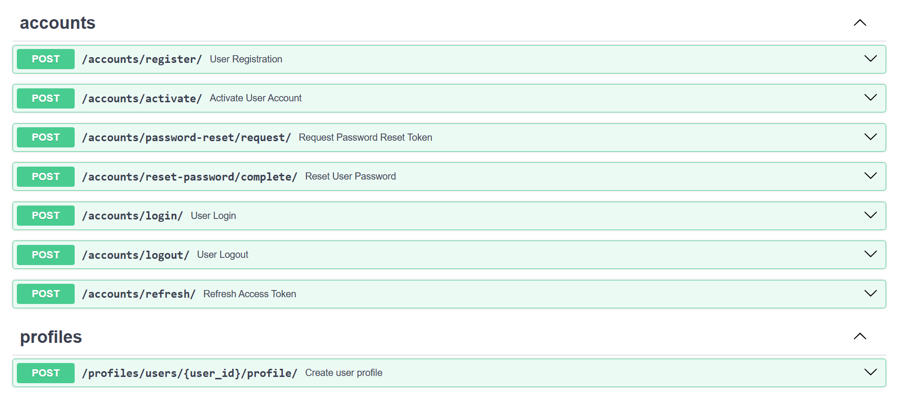
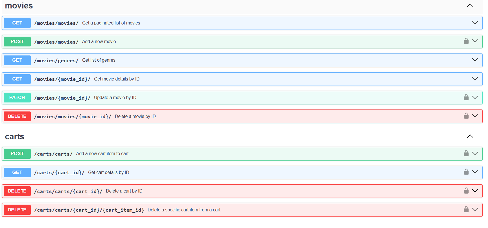

# Online Cinema Service

### Description

Project for cinema management written on FastAPI.  
Service where clients can see info about movies and buy them in oline cinema.

### Tasks:
##### 1) Authorization and Authentication

* User registration with activation via email.
* Account activation using a one-time activation token.
* Resending activation tokens if the previous token has expired.
* Periodic cleanup of expired activation and reset tokens using Celery Beat.
* Secure login that issues JWT access and refresh tokens.
* Logout functionality that revokes refresh tokens and invalidates sessions.
* Password reset flow with a token sent to the user’s email.
* Password complexity enforced during registration and reset.
* Role-based access control with predefined user groups (User, Moderator, Admin), each with distinct permissions.

##### 2) Movies

User Functionality:
* Browse the movie catalog with pagination support.
* View detailed information about individual movies.
* Filter movies by multiple criteria (e.g., release year, IMDb rating, genre, director, actor).
* Sort movies by various attributes (e.g., price, year).
* Search for movies using keywords in the title, description, director, or actor names.
* Apply all catalog functions (search, sort, filter) within the favorites list.
* View a list of all available genres along with a count of how many movies belong to each.

Moderator Functionality:
* Perform full CRUD operations on movies, genres, directors, and actors.
* Automatically create or link related records (e.g., genres, stars, certifications) when adding new movies.
* Prevent deletion of movies that have been purchased by users.

##### 3) Shopping Cart

User Functionality:
* Add movies to their shopping cart (only if not already added).
* Each user can have only one cart, which is created automatically if it doesn't exist.
* View the contents of their cart, including movie details (title, price, genres, release year).
* Remove specific movies from their cart.
* Delete their entire cart.
* Access to a cart is restricted to its owner or an admin.

Security and Access Control:
* Only the cart owner or users with the Admin role can view or modify the cart.
* Prevent adding the same movie to the cart multiple times.
* Return appropriate HTTP error codes (403/404) on unauthorized or invalid operations.


##### 4) Poetry for Dependency Management
##### 5) Swagger Documentation
##### 6) Integration Tests

##  Installing using GitHub

###  How to use it

> Clone the code 

```bash
$ # Get the code
$ git clone https://github.com/kkkkkkkkatya/online_cinema.git
$ cd cinema_fastapi
```

#### Set Up

> Install modules via `VENV`

```bash
$ python -m venv venv
$ source venv/bin/activate (on macOS)
$ venv\Scripts\activate (on Windows)
```

> Install Dependencies with Poetry

```bash
# Install Poetry if not already installed
$  pip install poetry

# Install project dependencies
$  poetry install
```

> Apply migrations manually

```bash
$ poetry run alembic upgrade head
```

> Run the server

```bash
$ uvicorn app.main:app --reload
```

> Verify Setup      
You can test the API by accessing the **Documentation**:

```bash
$ http://localhost:8000/docs
```

### First you need to register and than you can test endpoints
### Endpoints Example



### Features

* JWT authenticated
* Documentation is located at /docs
* Managing profiles, movies and shopping carts
